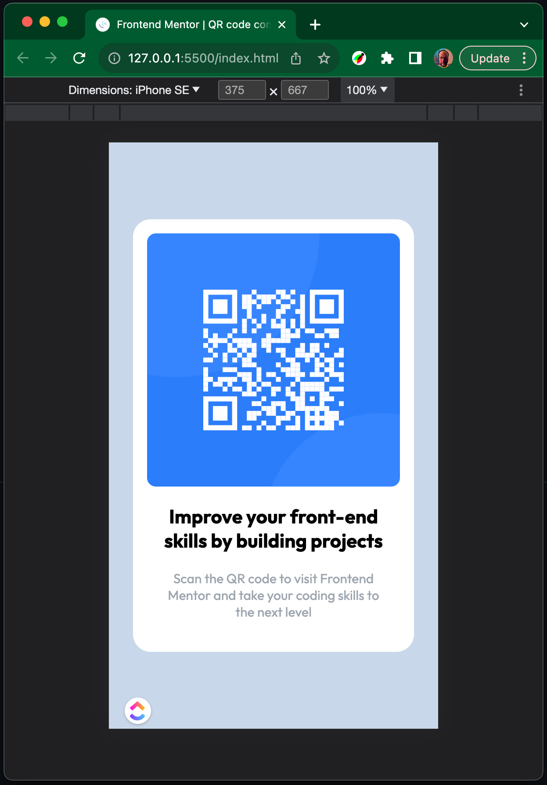

# Frontend Mentor - QR code component solution

This is a solution to the [QR code component challenge on Frontend Mentor](https://www.frontendmentor.io/challenges/qr-code-component-iux_sIO_H). Frontend Mentor challenges help you improve your coding skills by building realistic projects.

## Table of contents

- [Frontend Mentor - QR code component solution](#frontend-mentor---qr-code-component-solution)
  - [Table of contents](#table-of-contents)
  - [Overview](#overview)
    - [Screenshot](#screenshot)
    - [Links](#links)
  - [My process](#my-process)
    - [Built with](#built-with)
    - [What I learned](#what-i-learned)
    - [Continued development](#continued-development)
    - [Useful resources](#useful-resources)
  - [Author](#author)
  - [Acknowledgments](#acknowledgments)

## Overview

### Screenshot

### Links

- Solution URL: [On the GitHub](https://github.com/arturasmckwcz/qr-code-component-main)
- Live Site URL: [Frontend Mentor | QR code component](https://arturasmckwcz.github.io/qr-code-component-main/)

## My process

### Built with

- Semantic HTML5 markup
- CSS custom properties
- Flexbox
- CSS Grid

### What I learned

How to properly import font.

### Continued development

I'm considering to get more familiar with animations.

### Useful resources

- [MDN](https://developer.mozilla.org/en-US/) - This helped me for almost everything. I consider that is a good practice to check with MDN even I have grabbed a solution or an example somewhere else.
- [ChatGPT](https://chat.openai.com/) - You get what you ask here. And answers might be from another planet, fact-checking help a lot.

## Author

- Frontend Mentor - [@arturasmckwcz](https://www.frontendmentor.io/profile/arturasmckwcz)
- Twitter - [@arturasmckwcz](https://www.twitter.com/arturasmckwcz)

**Note: Delete this note and add/remove/edit lines above based on what links you'd like to share.**

## Acknowledgments

I asked ChatGPT 3.5 how to properly import Google font
